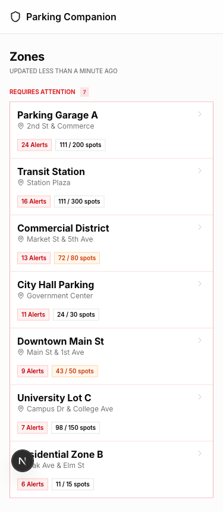
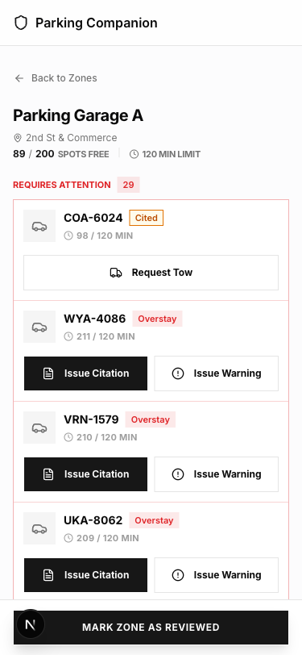
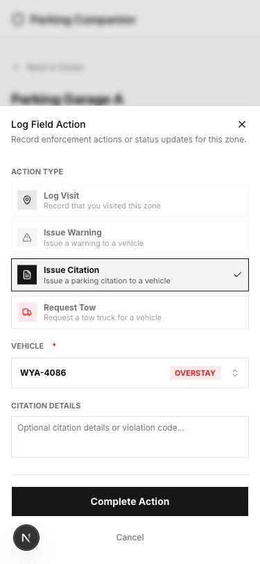
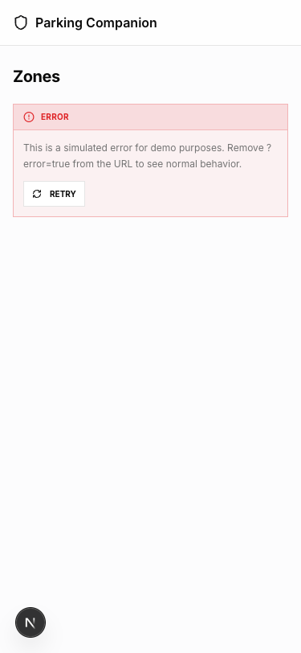

# Parking Enforcement Companion

Mobile-first prototype for parking enforcement officers to prioritize zones, understand zone status, and log field activity.

## Screenshots

| Zone List | Zone Detail | Log Action | Error State |
|-----------|-------------|------------|-------------|
|  |  |  |  |

## Setup & Run

```bash
pnpm install
pnpm dev
```

Open http://localhost:3000 in a mobile viewport (375px minimum width).

## Tech Stack

| Technology | Rationale |
|------------|-----------|
| **Next.js 16** | App Router provides co-located API routes that mock a real backend without external infrastructure. The frontend calls real HTTP endpoints, not imported JSON. |
| **TypeScript** | Type safety across API contracts and UI components. Shared types between API and client. |
| **Tailwind CSS** | Rapid mobile-first prototyping with consistent spacing, sizing, and responsive utilities. |
| **shadcn/ui** | Accessible, touch-optimized components with proper tap targets (44px minimum). |
| **date-fns** | Lightweight date formatting for "time ago" displays. |

## API Documentation

### GET `/api/zones`

Returns all zones with nested vehicles and activities.

**Query Parameters:**
- `priority`: `'high'` | `'all'` (default: `'all'`)
  - `high`: Only zones with violations or >80% occupancy
  - `all`: All zones, sorted by priority

**Response:**
```json
{
  "zones": [
    {
      "id": "zone-1",
      "name": "Downtown Main St",
      "location": "Main St & 1st Ave",
      "maxCapacity": 50,
      "timeLimit": 120,
      "vehicles": [
        {
          "id": "vehicle-1",
          "zoneId": "zone-1",
          "licensePlate": "ABC-1234",
          "type": "car",
          "arrivalTime": "2024-01-15T10:30:00Z"
        }
      ],
      "activities": [
        {
          "id": "activity-1",
          "zoneId": "zone-1",
          "type": "visit",
          "payload": { "notes": "Routine check" },
          "occurredAt": "2024-01-15T12:00:00Z"
        }
      ]
    }
  ],
  "lastUpdated": "2024-01-15T14:00:00Z"
}
```

### GET `/api/zones/:id`

Returns a single zone with nested vehicles and activities.

**Response:**
```json
{
  "zone": {
    "id": "zone-1",
    "name": "Downtown Main St",
    "location": "Main St & 1st Ave",
    "maxCapacity": 50,
    "timeLimit": 120,
    "vehicles": [...],
    "activities": [...]
  }
}
```

### POST `/api/activity`

Logs an officer action.

**Request:**
```json
{
  "zoneId": "zone-1",
  "type": "citation",
  "payload": {
    "vehicleId": "vehicle-1",
    "licensePlate": "ABC-1234",
    "notes": "Exceeded 2hr limit"
  },
  "occurredAt": "2024-01-15T14:30:00Z"
}
```

**Activity Types:** `visit`, `warning`, `citation`, `tow`

**Response:**
```json
{
  "activity": {
    "id": "activity-123",
    "zoneId": "zone-1",
    "type": "citation",
    "payload": { ... },
    "occurredAt": "2024-01-15T14:30:00Z"
  }
}
```

## Triggering Demo States

### Error States

Add `?error=true` to any page URL and refresh:
- **Zone list:** `http://localhost:3000/?error=true`
- **Zone detail:** `http://localhost:3000/zones/zone-1?error=true`

### Empty States

- **Zone list:** `http://localhost:3000/?empty=true`
- **Zone detail:** Navigate to a zone with no overstays to see "All clear" state

## Project Structure

```
src/
├── app/
│   ├── api/
│   │   ├── zones/          # GET /api/zones
│   │   │   └── [id]/       # GET /api/zones/:id
│   │   └── activity/       # POST /api/activity
│   ├── zones/[id]/         # Zone detail page
│   └── page.tsx            # Zone list (home)
├── components/
│   ├── ui/                 # shadcn primitives
│   ├── zone-card.tsx       # Zone list item
│   ├── vehicle-row.tsx     # Vehicle with quick actions
│   ├── log-action-sheet.tsx# Activity logging form
│   └── api-state-boundary.tsx # Loading/error/empty wrapper
└── lib/
    ├── types.ts            # Domain types (Zone, Vehicle, Activity)
    ├── api.ts              # API client functions
    ├── compute.ts          # Shared business logic (violations, occupancy)
    ├── mock-data.ts        # Seed data generation
    └── activity-types.ts   # Activity type registry
```

## Written Summary

See [docs/SUMMARY.md](docs/SUMMARY.md) for the 500-750 word written summary covering:
- What I prioritized and why
- What I cut and why
- Assumptions about user needs
- API design approach and tradeoffs
- What I would build next
